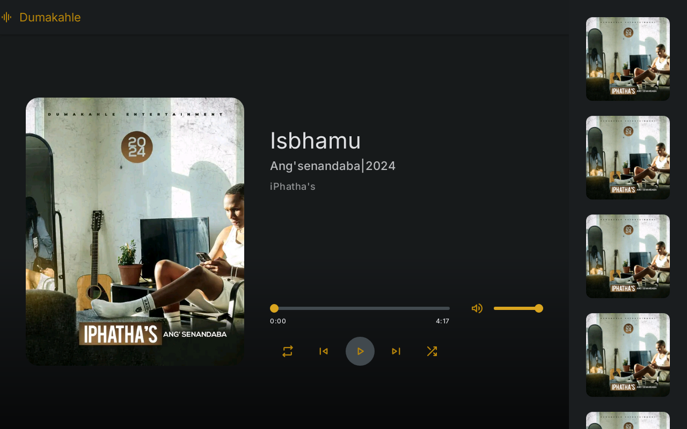

# Dumakahle Music Player
## Preview


A simple music player website created for my favorite Maskandi artist, **Dumakahle**. Built using **HTML**, **CSS**, and **JavaScript**, this web app allows users to play and enjoy a curated selection of Dumakahle's music.

## Features

- **Play, Pause, and Stop Controls:** Basic music controls for easy navigation.
- **Custom UI:** A minimalist design inspired by Dumakahle's style.
- **Responsive Layout:** The player adjusts to different screen sizes for both mobile and desktop users.
- **Track List:** Easily switch between different tracks.

## Tech Stack

- **HTML** - For structuring the web page and music player.
- **CSS** - For styling the player and the layout.
- **JavaScript** - For adding functionality like play, pause, and stop controls.

## Getting Started

1. Clone this repository:

   ```bash
   git clone https://github.com/tholumuzikhuboni/dumakahle-music-player.git
